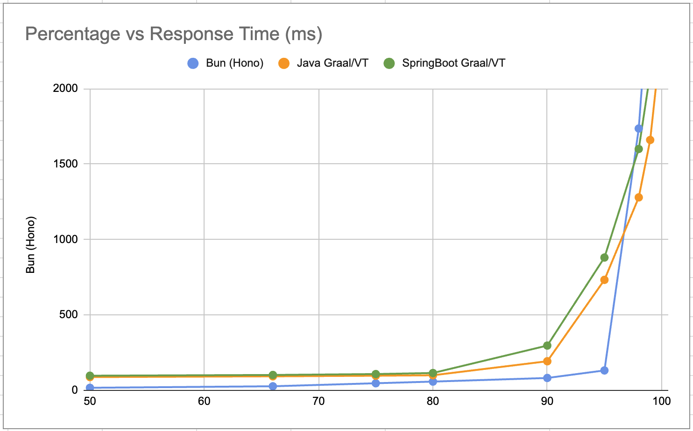

# Native Server Containerized Load Tests

Here are the results of `ab` load testing against containerized native applications running with 0.4 CPU and 64MB memory.

- Response percentage vs response time in milliseconds.

| Percentage / ms | Bun (Hono) | SpringBoot Graal/VT | Java Graal/VT |
| --------------- | ---------- | ------------------- | ------------- |
| 50              | 16         | 96                  | 87            |
| 66              | 26         | 101                 | 92            |
| 75              | 46         | 107                 | 96            |
| 80              | 57         | 114                 | 99            |
| 90              | 81         | 296                 | 192           |
| 95              | 131        | 880                 | 732           |
| 98              | 1736       | 1600                | 1279          |
| 99              | 2763       | 2101                | 1660          |
| 100             | 6255       | 2665                | 2360          |





- Average Memory Usage in MegaBytes.

|            | Bun | SpringBoot Graal/VT | Java Graal/VT |
| ---------- | --- | ------------------- | ------------- |
| Memory(MB) | 63  | 45                  | 30            |


# Nginx as Downstream

Nginx is used as the downstream server for the proxy server.

Run Nginx in a container:
```sh
docker run --rm -it -p 8080:80 --cpus=1 --memory=512m --name nginx nginx
```


# Testing

Please follow each project's README.md for instructions on how to build and run the application as a gateway server.

The testing agains the gateway server is done by running the following command:

```sh
ab -c 100 -n 10000 http://localhost:8080/external
```

Here the `external` path is proxied/forwarder/requested to the Nginx server running at the URL defined by the `EXTERNAL_URL` environment variable.

Here is an example of the `EXTERNAL_URL` environment variable usage:

```sh
docker run --rm -it -p 8080:8080 --cpus=0.4 --memory=64m -e EXTERNAL_URL=http://192.168.68.01:9090/  --name spring-graal-vt docker.io/library/spring-graal-vt
```