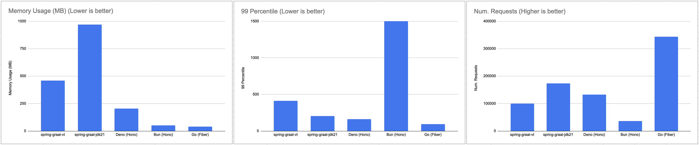

# TEST WITH 2 CPU 2GB RAM

Use Nginx as backend.

```shell
docker run --rm -d -p 9090:80 --cpus=1 --memory=1024m --name nginx nginx
```



## BUN

~110% CPU, ~50MB, 36563 requests

```shell
docker run --rm -it -p 8080:3000 --cpus=2 --memory=2048m --name bun-hello-world docker.io/library/bun-hello-world


root@ubuntu-s-8vcpu-16gb-ams3-01:~/container-tests/bun-hono# wrk -t10 -c500 -d30s --latency http://localhost:8080/external
Running 30s test @ http://localhost:8080/external
  10 threads and 500 connections
  Thread Stats   Avg      Stdev     Max   +/- Stdev
    Latency   278.16ms  409.94ms   1.61s    81.82%
    Req/Sec   440.30    364.25     1.14k    45.44%
  Latency Distribution
     50%   74.37ms
     75%  168.02ms
     90%    1.00s
     99%    1.50s
  36563 requests in 30.10s, 25.52MB read
  Socket errors: connect 0, read 0, write 0, timeout 3176
Requests/sec:   1214.79
Transfer/sec:    868.38KB
```


## DENO

~125% CPU, ~205MB, 132272 requests

```shell
docker run --rm -it -p 8080:8080 --cpus=2 --memory=2048m --name deno-server deno-server:latest


root@ubuntu-s-8vcpu-16gb-ams3-01:~/container-tests/deno-hono# wrk -t10 -c500 -d30s --latency http://localhost:8080/external
Running 30s test @ http://localhost:8080/external
  10 threads and 500 connections
  Thread Stats   Avg      Stdev     Max   +/- Stdev
    Latency   113.34ms   14.74ms 195.40ms   75.66%
    Req/Sec   442.29     80.19   780.00     82.02%
  Latency Distribution
     50%  110.74ms
     75%  120.93ms
     90%  131.35ms
     99%  162.28ms
  132272 requests in 30.10s, 95.24MB read
Requests/sec:   4394.51
Transfer/sec:      3.16MB
```


## GOFIBER

~195% CPU, 40MB, 343930 requests

```shell
docker run --rm -it -p 8080:8080 --cpus=2 --memory=2048m --name go-fiber go-fiber


root@ubuntu-s-8vcpu-16gb-ams3-01:~/container-tests# wrk -t10 -c500 -d30s --latency http://localhost:8080/external
Running 30s test @ http://localhost:8080/external
  10 threads and 500 connections
  Thread Stats   Avg      Stdev     Max   +/- Stdev
    Latency    43.83ms   21.41ms 176.60ms   64.45%
    Req/Sec     1.15k   150.91     2.71k    73.30%
  Latency Distribution
     50%   39.79ms
     75%   60.66ms
     90%   73.12ms
     99%   94.42ms
  343930 requests in 30.09s, 240.42MB read
Requests/sec:  11431.22
Transfer/sec:      7.99MB
```


## GO (STANDARD LIBRARY)

~200% CPU, 60MB, 32879 requests

```shell
docker run --rm -it -p 8080:8080 --cpus=2 --memory=2048m --name go-hello go-hello


root@ubuntu-s-8vcpu-16gb-ams3-01:~/container-tests# wrk -t10 -c500 -d30s --latency http://localhost:8080/external
Running 30s test @ http://localhost:8080/external
  10 threads and 500 connections
  Thread Stats   Avg      Stdev     Max   +/- Stdev
    Latency   479.52ms  449.57ms   2.00s    77.14%
    Req/Sec   115.51    173.37     1.32k    89.45%
  Latency Distribution
     50%  359.07ms
     75%  783.83ms
     90%    1.12s
     99%    1.77s
  32879 requests in 30.10s, 22.95MB read
  Socket errors: connect 0, read 0, write 0, timeout 461
Requests/sec:   1092.48
Transfer/sec:    780.95KB
```


## JAVA STD LIB - NATIVE GRAALVM

~200% CPU, 280MB, 132333 requests

```shell
docker run --rm -it -p 8080:8080 --cpus=2 --memory=2048m --name vt-grl-app vt-grl-app:0.0.1


root@ubuntu-s-8vcpu-16gb-ams3-01:~# wrk -t10 -c500 -d30s --latency http://localhost:8080/external
Running 30s test @ http://localhost:8080/external
  10 threads and 500 connections
  Thread Stats   Avg      Stdev     Max   +/- Stdev
    Latency   206.29ms  282.03ms   1.56s    85.61%
    Req/Sec   442.79    157.92     1.14k    70.46%
  Latency Distribution
     50%   95.38ms
     75%  158.45ms
     90%  706.42ms
     99%    1.15s
  132333 requests in 30.04s, 87.33MB read
  Socket errors: connect 0, read 39341, write 0, timeout 60
Requests/sec:   4404.66
Transfer/sec:      2.91MB
```


## SPRING BOOT - GRAALVM NATIVE

~200% CPU, ~460MB, 99311 requests


```shell
docker run --rm -it -p 8080:8080 --cpus=2 --memory=2048m --name spring-graal-vt spring-graal-vt


root@ubuntu-s-8vcpu-16gb-ams3-01:~# wrk -t10 -c500 -d30s --latency http://localhost:8080/external
Running 30s test @ http://localhost:8080/external
  10 threads and 500 connections
  Thread Stats   Avg      Stdev     Max   +/- Stdev
    Latency   155.08ms   85.38ms   1.30s    80.45%
    Req/Sec   341.75    104.01     1.06k    76.48%
  Latency Distribution
     50%  123.45ms
     75%  195.40ms
     90%  269.80ms
     99%  412.69ms
  99311 requests in 30.08s, 69.15MB read
Requests/sec:   3301.69
Transfer/sec:      2.30MB
```


## SPRING BOOT - JDK 21

~200% CPU, ~970MB, 173872 requests


```shell
docker run --rm -it -p 8080:8080 --cpus=2 --memory=2048m --name spring-graal-jdk spring-graal-jdk


root@ubuntu-s-8vcpu-16gb-ams3-01:~# wrk -t10 -c500 -d30s --latency http://localhost:8080/external
Running 30s test @ http://localhost:8080/external
  10 threads and 500 connections
  Thread Stats   Avg      Stdev     Max   +/- Stdev
    Latency    87.06ms   35.98ms 380.20ms   74.55%
    Req/Sec   583.92    170.39     1.04k    68.13%
  Latency Distribution
     50%   82.04ms
     75%  102.20ms
     90%  130.36ms
     99%  203.36ms
  173872 requests in 30.06s, 121.07MB read
Requests/sec:   5784.84
Transfer/sec:      4.03MB
```

