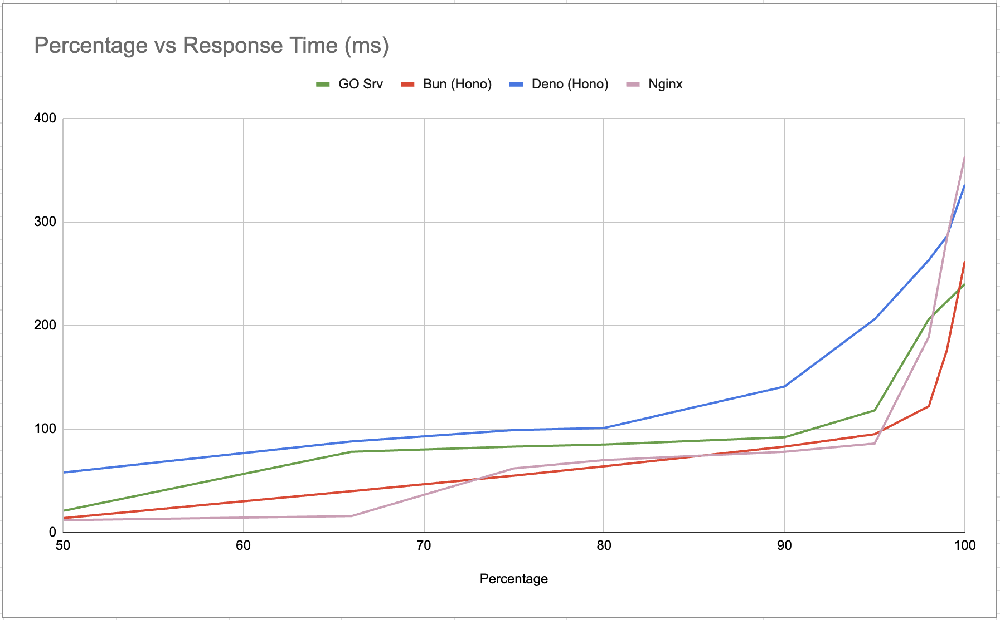
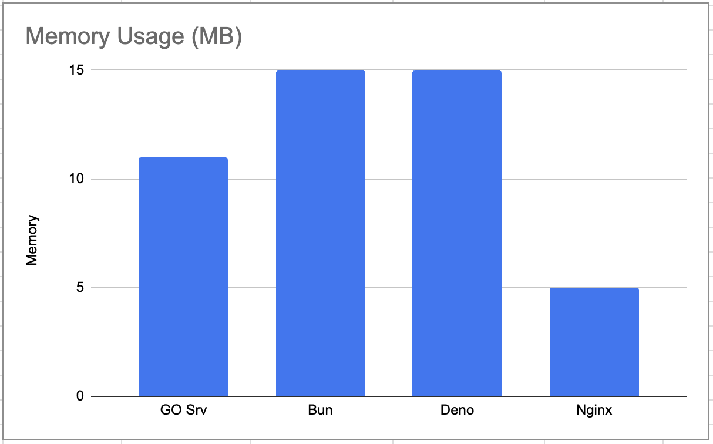

# Native Server Containerized Load Tests

Here are the results of `ab` load testing against containerized native applications running with 0.2 CPU and 16MB memory.

- Response percentage vs response time in milliseconds.

| Percentage / ms | GO Srv | Bun (Hono) | Deno (Hono) | Nginx |
| --------------- | ------ | ---------- | ----------- | ----- |
| 50              | 21     | 14         | 58          | 12    |
| 66              | 78     | 40         | 88          | 16    |
| 75              | 83     | 55         | 99          | 62    |
| 80              | 85     | 64         | 101         | 70    |
| 90              | 92     | 83         | 141         | 78    |
| 95              | 118    | 95         | 206         | 86    |
| 98              | 206    | 122        | 263         | 189   |
| 99              | 223    | 176        | 286         | 284   |
| 100             | 240    | 262        | 336         | 363   |





- Average Memory Usage in MegaBytes.

|            | GO Srv | Bun | Deno | Nginx |
| ---------- | ------ | --- | ---- | ----- |
| Memory(MB) | 11     | 15  | 15   | 5     |




# Testing

Please follow each project's README.md for instructions on how to build, run, and test the applications.


# Nginx as a Baseline

Nginx is used as a baseline for comparison. 

Run Nginx in a container:
```sh
docker run --rm -it -p 8080:80 --cpus=0.2 --memory=16m --name nginx nginx
```

Test:
```sh
curl -v --max-time 2  http://localhost:8080/
```

Observe:
```sh
docker stats nginx
```

Load Test:
```sh
ab -c 100 -n 10000 http://localhost:8080/
```

